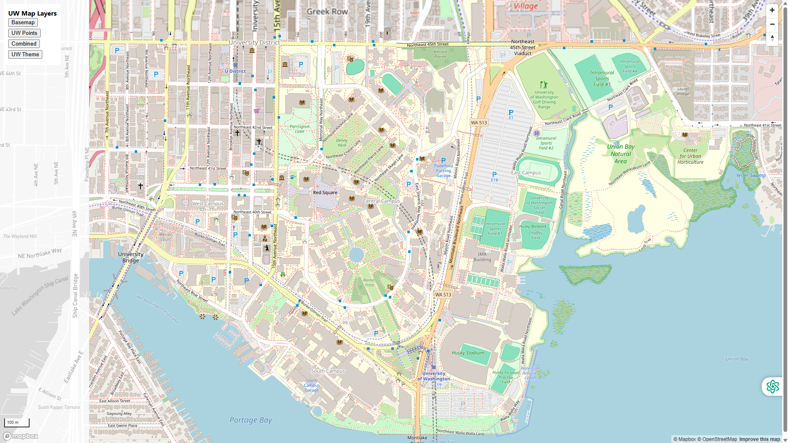
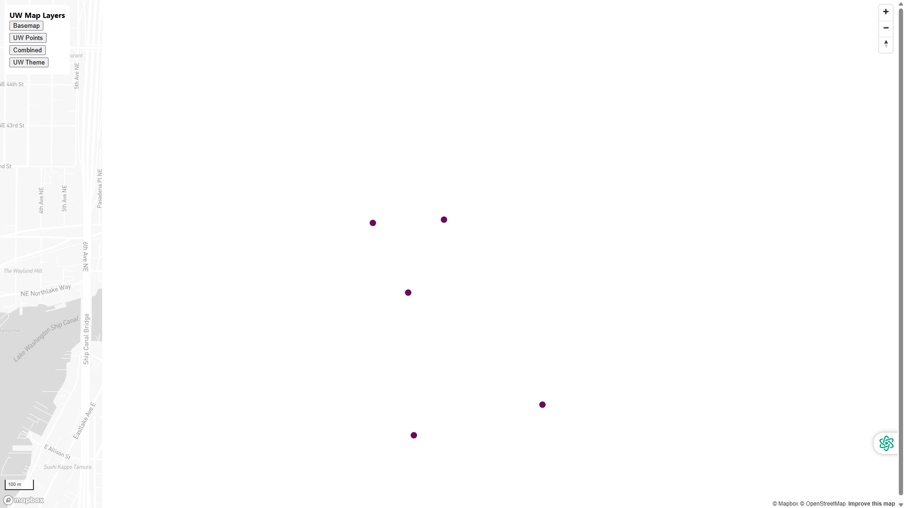
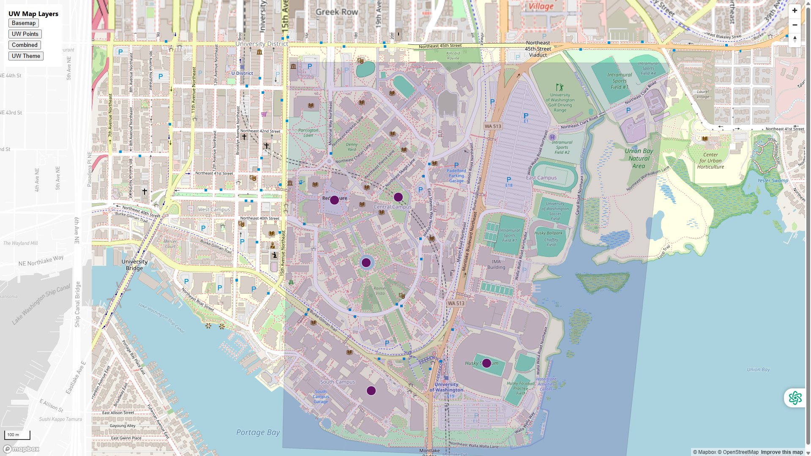

# Lab 4 – Map Design and Tile Generation

## Web Map
https://kha50.github.io/lab4-mapbox-tiles/

---

## Study Area
University of Washington campus, Seattle, Washington.

## Zoom Levels
All tile sets were exported at zoom levels 14–16.

---

## Tile Set 1 – Basemap
A minimal basemap providing geographic context for the UW campus.

---

## Tile Set 2 – UW Points (Thematic Layer)
Digitized point features styled in UW purple.

---

## Tile Set 3 – Combined Map
Basemap and thematic UW points combined.

---

## Tile Set 4 – UW Theme Map
A UW-themed design using a purple overlay.

